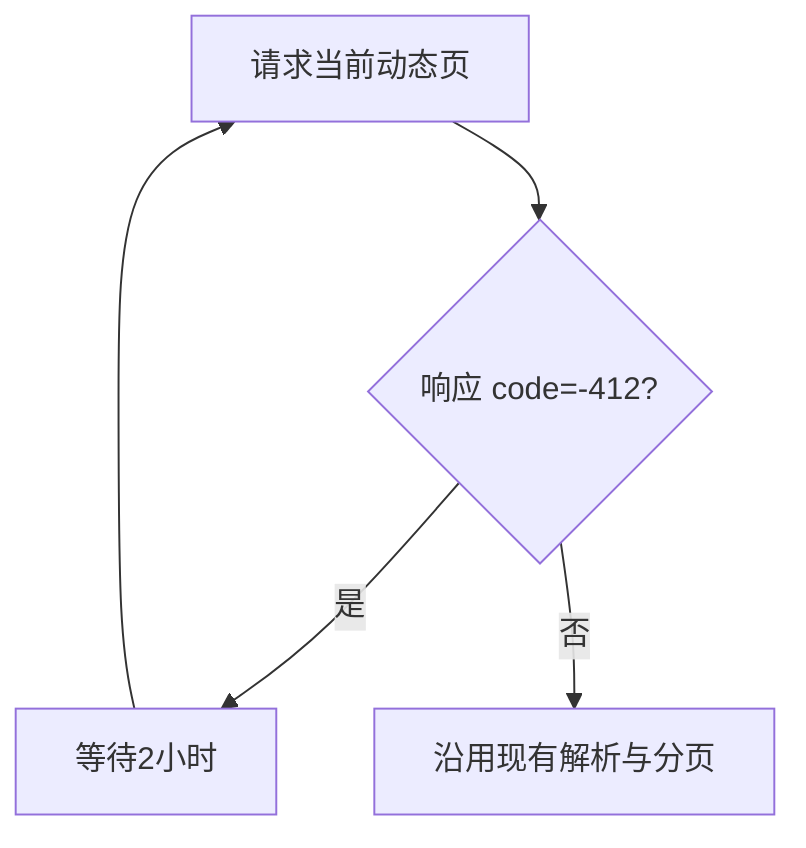
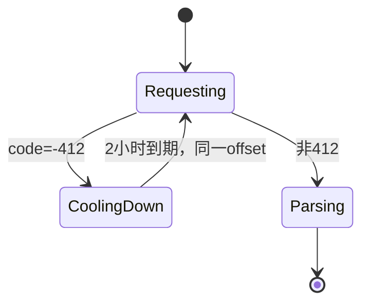

# 412 原页续跑

## 原始需求或故障现象

> 如果碰到412, 直接暂停睡眠2小时, 然后继续可以吗? 这种怎么样? 我要效果是尽量把进度存下来, 而不是每次都从头开始导致412
>
> 最简单的是什么方案
>
> 可以,试试, 然后推远程拉取容器内的

## 目标

原始独立结果数：1

| ID | 可观察结果 | 成功证据 |
| --- | --- | --- |
| G-001 | 动态列表请求返回 `code=-412` 时，当前进程等待2小时并重试同一分页，不返回上层导致任务从头执行 | 定向测试证明同一 offset 请求两次且仅调用一次 7200000ms 延时 |

- 原始结果无遗漏：是

## 范围与非目标

- 允许修改：`lib/core/searcher.js` 及其定向测试。
- 保持不变：非412错误仍走现有返回/重试逻辑；关注列表、动态删除和取消关注逻辑不变。
- 非目标：磁盘检查点、跨容器重启恢复、修改青龙18小时超时、处理 `origin_uid` 旁支问题。

## 事实、假设与决策

### 方案调研

| 时间 | 查询词 | 来源 | 可复用机制 | 结论 |
| --- | --- | --- | --- | --- |
| 2026-08-25 | Bilibili -412 | `pskdje/bilibili-API-collect` `docs/misc/errcode.md` | `-412` 表示客户端IP被服务端风控 | 仅对精确412长等待 |
| 2026-08-25 | Node.js timers | `https://nodejs.org/api/timers.html` | ref'ed timer保持事件循环存活 | 2小时 `delay()` 可维持原进程状态 |
| 2026-08-25 | 仓库重试与延时 | `lib/core/searcher.js`, `lib/utils.js` | 复用现有 `utils.delay()` 和当前 offset 局部变量 | 不新增依赖或持久化层 |

- 仓库已有实现：`utils.delay()`；`checkAllDynamic()` 持有当前 `offset`。
- 成熟依赖候选：不需要；标准计时器已满足。
- 最小自研候选：在动态列表请求点识别精确 `code=-412`，等待后重试同一请求。
- Ponytail：full；选择“复用仓库实现”。
- 跳过：通用重试框架改造、磁盘检查点、新配置项，均超出当前目标。
- 升级条件：容器重启或18小时任务超时造成的进度丢失得到实际日志证据。
- 依赖尽调：不适用，无新增依赖。
- 否定结果：修改通用 `retryfn()` 会影响所有接口错误；仅在 `clear.js` 处理无法获得精确412响应。

### 相关场景

| 场景 | 预期与验证方式 |
| --- | --- |
| 首次返回412、随后成功 | 等待7200000ms并使用相同 offset 重试 |
| 非412错误 | 不进行2小时等待，保持现有错误路径 |
| 正常响应 | 不等待，正常返回分页结果 |

## 业务流程

## 状态机

## 公共契约与数据语义

`Searcher.checkAllDynamic(host_mid, pages, time, offset)` 的签名和成功返回值不变；412由内部等待吸收。等待单位为毫秒，固定 `7200000`。

## 需求

| ID | 对应目标 | 需求与验收标准 |
| --- | --- | --- |
| R-001 | G-001 | 精确412等待2小时并重试同一页；正常响应及其他错误行为不变 |

## 相邻行为与风险

`start` 与 `clear` 共用该方法，二者遇到同一动态接口412都会原页续跑；这是用户确认的最简单方案。进程终止仍丢失内存进度。

## 未决项

无。

## 实现基线

基线 ID：BL-001  
状态：已确认  
确认人及时间：用户，2026-08-25（“可以,试试”）

| 类别 | 已锁定内容 | 不适用理由 |
| --- | --- | --- |
| 目标与验收 | 412等待2小时后同页续跑 | — |
| 业务流程 | 请求→412冷却→同页请求 | — |
| 状态机 | Requesting/CoolingDown/Parsing | — |
| 公共契约 | 方法签名不变 | — |
| 选定方案与影响层 | `checkAllDynamic()` 内部最小循环 | — |
| 不变量与非目标 | 非412不长等；不做磁盘持久化 | — |

- 代理可决定：精确匹配方式、日志措辞、定向测试结构。
- Ponytail 最小性复核：通过；单一请求点修改，无新层、配置或依赖。
